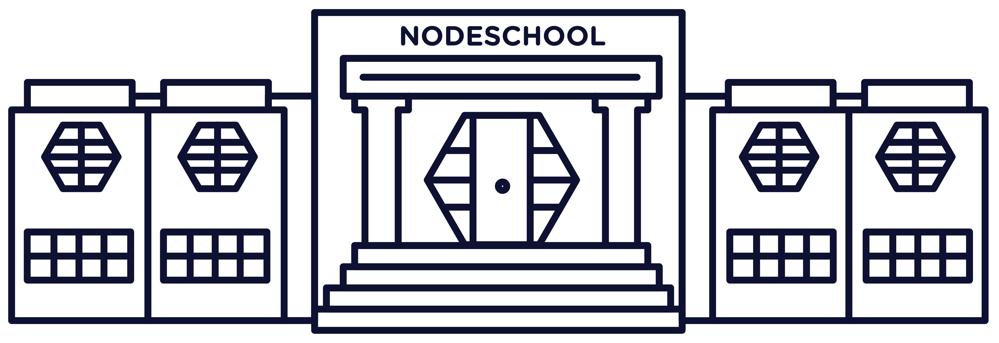

  
  <h1>NODESCHOOL</h1>

## learnyounode
**NodeJS básico: I/O assíncrono, HTTP**

## Exercicios do workshop

- [X] HELLO WORLD
- [X] BABY STEPS
- [X] MY FIRST I/O!
- [X] MY FIRST ASYNC I/O!
- [X] FILTERED LS
- [X] MAKE IT MODULAR
- [X] HTTP CLIENT
- [X] HTTP COLLECT
- [X] JUGGLING ASYNC 
- [X] TIME SERVER
- [X] HTTP FILE SERVER
- [ ] HTTP UPPERCASERER
- [ ] HTTP JSON API SERVER

**[NodeSchool](https://nodeschool.io/)** |
**[learnyounode](https://github.com/workshopper/learnyounode)**
